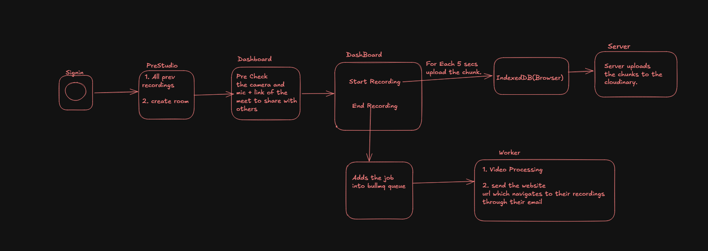

# Recio - Record Studio-Quality Podcasts and Videos from Anywhere

## How to Run

1. Clone the repository
2. Navigate to the frontend ```cd Backend ``` or use Docker File 

3. Add all the things mentioned in the .env.example to the .env file, then install dependencies
 ```npm install ```

5. Start the development server
``` npm run dev ```

## Features added (with love❤️)
1. Built a Google Meet–like video platform with real-time calls, screen sharing, recording, and dynamic layouts
using LiveKit (WebRTC).
2. Engineered a fault-tolerant, chunk-based recording pipeline using IndexedDB buffering to prevent data loss
during network interruptions and ensure reliable uploads.
3. Designed an asynchronous BullMQ-driven processing system to merge multi-participant streams, generate final
recordings, and notify users via email.

## Tech Stack 
React, TypeScript, TailwindCSS, FramerMotion, Node.js, LiveKit SFU, Bullmq

## Architecture 

